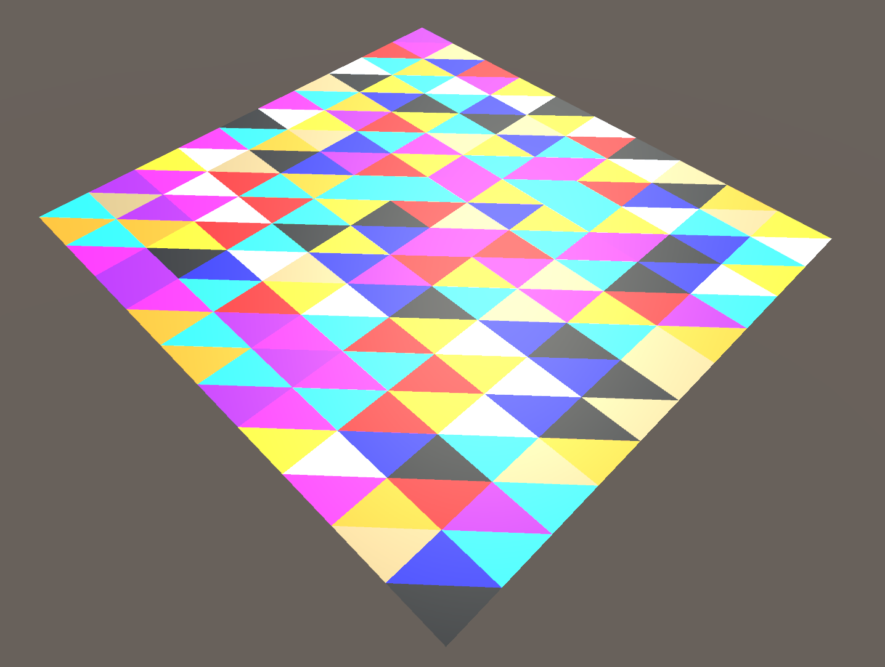
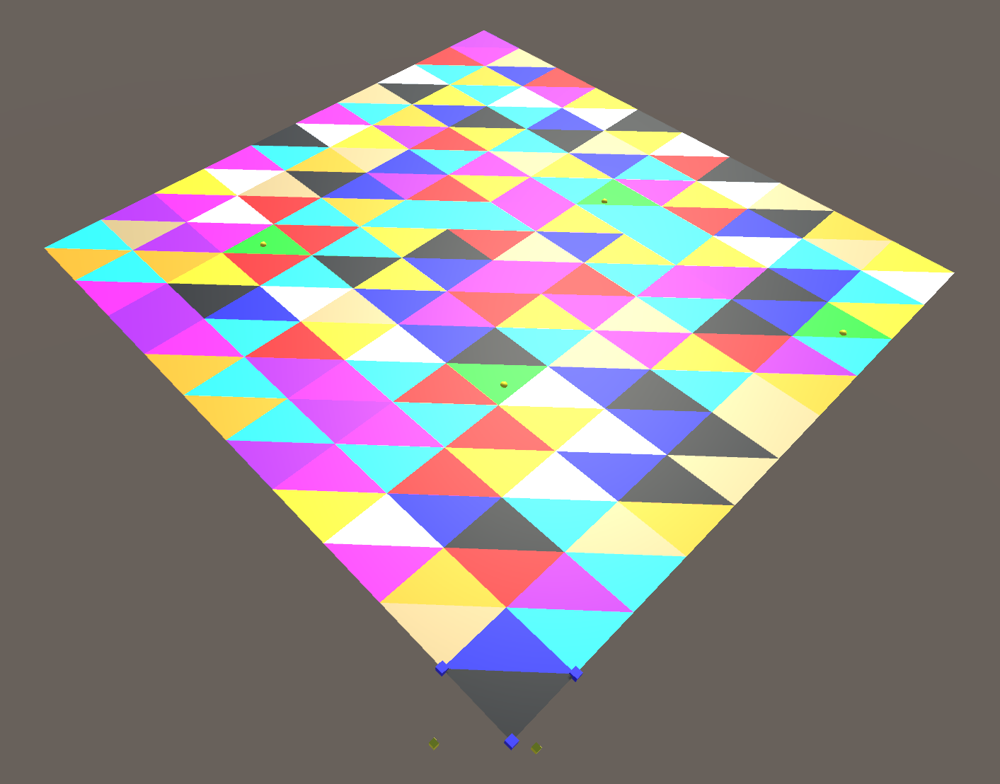
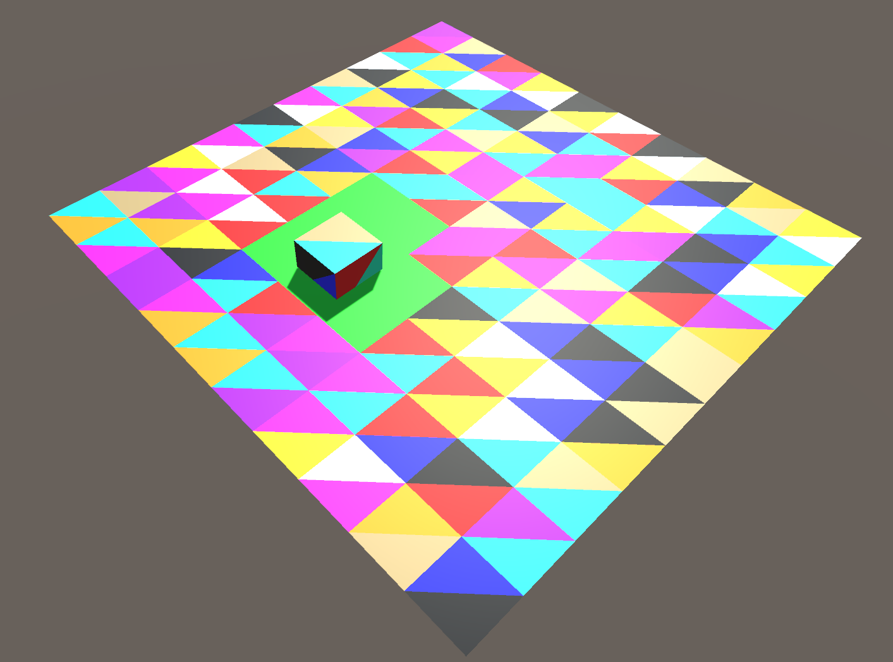

# My Amazing Project : Cutting mesh

This project was created to study different kind of manipulation i can do on 3D mesh and to see if i can cut a gamobject in real time following the intersection of 2 gameobject.

---

## Key Features
- **Feature 1**: Browse through the triangles of the mesh.
- **Feature 2**: Create a cube thanks to information coresponding to the mesh in a script
- **Feature 3**: Detect which triangle i have clicked on with a ray method
- **Feature 4**: Detect all the triangle which are in interjection with another gameobject
---

## Demo

### Feature 1

Here I have colored each triangle on a plane.

### Feature 2

Here the rectangle that i made by adding the vertices and triangle to the meshfilter component

### Feature 3

Each time that i click on the plane a ray is created to detect the intersection between the gameobject and a line and when the triangle is discovered i color it into green and create a yellow sphere on the intersection

### Feature 4

I made the same system with the intersection between 2 gameobject, it is not yet perfectly accurate and not in real time but i will be there

---

### **Technologies Used**

## Technologies Used
- **Programming Languages**: C#
- **Frameworks**: Unity
- **Other Tools**: VS code

---

## Challenges and Learnings
This project helped me deepen my understanding of the concept of mesh and algorithmic geometry on unity. The project in itself is a challenge and to make it in real time seem to be quite difficult to make for complex mesh geometry.

The project is still in progress and i will update this page each time i make a breakthrough.

## TODO
* make it so that the intersection between the 2 actual gameobject are perfectly accurate.
* try this approach on more complicated mesh (with more triangle)
* see some research paper which have already tried to solve this problem, compare their method with mine and try to implement it
---

## Let's Connect!
If you're interested in learning more about this project or would like to discuss how I can contribute to your team, feel free to reach out!

📧 Email: diet.florent1@gmail.com
💼 [LinkedIn Profile](https://www.linkedin.com/in/florent-diet-29896629b/)  

